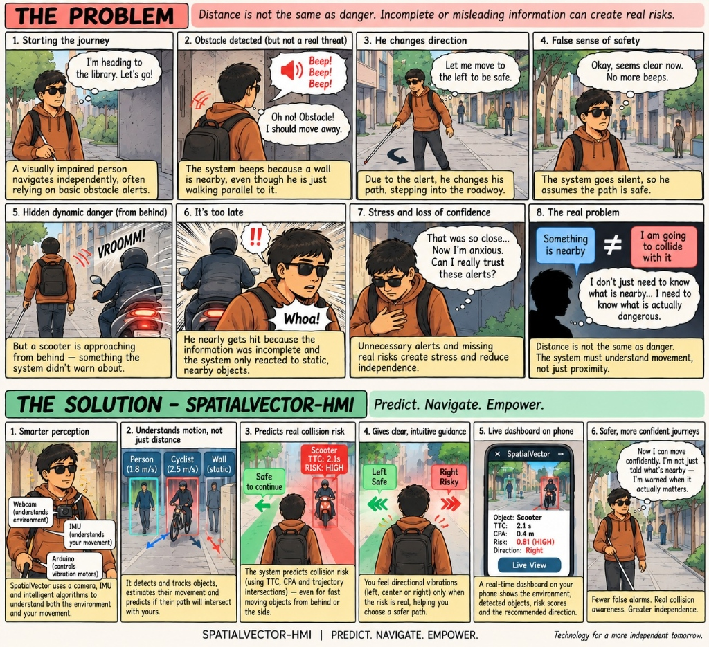

# 🦾 SpatialVector-HMI — Predict. Navigate. Empower.

> **Nirmaan 2026 Hackathon · Healthcare & Biotech Track**

A chest-worn, vision-first local safety system that tracks nearby objects, estimates camera/user motion, **predicts future trajectory intersection**, computes collision risk, selects a safer corridor, and communicates that decision through **directional haptics**.

---

## The Problem & The Solution



Distance is not the same as danger. Incomplete or misleading information creates real risks.

> A visually impaired person navigating with a cane gets alerted when a *wall is nearby*, even while walking parallel to it — causing unnecessary panic. Meanwhile, a fast-moving scooter approaching from behind goes **undetected** because it was never "close enough" by simple proximity metrics.

**The system must understand movement, not just proximity.**

---

## The Solution Breakdown

**SpatialVector-HMI** goes beyond "something is nearby" → it answers:

| Question | How |
|---|---|
| Is the user on a collision course? | Trajectory intersection (TTC + CPA) |
| How soon will the risk materialize? | Time-To-Collision (TTC) |
| Which direction is safer? | Safe-corridor selection (L/C/R) |
| How do we communicate with minimal cognitive load? | Directional vibration haptics |

---

## Core Thesis

> *"We do not ask only what is nearby. We estimate whether the user and the obstacle are on a collision course, how soon the risk will materialize, and which local corridor is safer."*

---

## System Overview

```
Webcam (chest-mounted)
    ↓
M01 Frame Acquisition & Timebase
    ↓
M02 Object Detection (YOLO)       ←──── IMU / Gyroscope
    ↓                                        ↓
M03 Multi-Object Tracking         M05 Ego-Motion Compensation
    ↓                                        ↓
M04 Optical Flow & FOE ──────────────────────┘
    ↓
M06 Motion & Geometry
    ↓
M07 Collision Prediction (TTC + CPA + Intersection)
    ↓
M08 Risk Engine & State Machine  →  Phone Dashboard (M11)
    ↓
M09 Safe-Corridor Selector + Haptic Policy
    ↓
M10 Arduino Haptic Interface  →  3× Vibration Motors (L/C/R)
    ↓
M12 Logger + Replay + Evaluation Harness
```

---

## Hardware Components

| Component | Description & Role |
|---|---|
| Chest-Mounted Camera / Webcam | Real-time egocentric visual sensing |
| Microcontroller (Arduino Uno) | Haptic driver & pattern controller |
| Vibration Motors (×3) | Directional tactile feedback (Left / Center / Right) |
| IMU / Gyroscope (MPU6050) | Camera rotation & body ego-motion compensation |
| Power Bank | Portable, untethered power supply |
| Chest Harness | Rigid, aligned mounting for camera & IMU |

---

## Software Stack

- **Computer Vision**: OpenCV, Ultralytics YOLO (nano/ONNX)
- **Tracking**: ByteTrack / BoT-SORT
- **Motion**: Lucas-Kanade optical flow, NumPy geometry
- **Arduino**: Serial/BLE haptic protocol
- **Dashboard**: FastAPI / Flask + WebSocket → mobile browser UI
- **Logging**: JSONL session files + OpenCV video replay

---

## Priority Order (P0 → P3)

| Priority | Feature |
|---|---|
| **P0** | Frame capture, YOLO detection, multi-object tracking, optical flow, IMU, ego-motion, TTC/CPA, trajectory intersection, risk state machine, safe corridor, Arduino haptics, logger/replay |
| **P1** | Phone dashboard, dynamic obstacle prediction, uncertainty states, scenario modes |
| **P2** | Free-space segmentation, face detection (Social Assist only — **not** in safety path) |
| **P3** | Embedded deployment, voice/cloud (deferred) |

---

## 24-Hour Build Roadmap

| Time | Milestone |
|---|---|
| 0–2h | Smoke tests across all four roles |
| 2–4h | P0 foundations pass |
| 4–6h | Prediction works on synthetic data |
| 6–8h | Synthetic → physical haptic end-to-end |
| 8–10h | Live laptop demo core running |
| 10–12h | Demo scenarios 1 & 2 pass |
| 12–15h | Demo scenarios 3 & 4 pass |
| 15–18h | Replay is repeatable |
| 18–21h | Full system stable end-to-end |
| 21–24h | ⛔ Feature freeze — bug fixes & demo polish only |

---

## Demo Scenarios

| Scene | Physical Action | Haptic Behavior | Judge Takeaway |
|---|---|---|---|
| Baseline | Open space walk | Silent | System doesn't constantly alert |
| Parallel wall | Walk beside wall at close offset | Silent / low caution | Nearby ≠ dangerous |
| Turn toward wall | Rotate body toward obstacle | Center pulses faster | Risk changes as trajectory changes |
| Crossing person | Person crosses future path | Side motor warns | Dynamic objects predicted, not just detected |
| Safe passing | Person passes outside corridor | No warning | Same distance, different decision |
| Sensor degradation | Interrupt IMU / create low-flow scene | DEGRADED pattern | System exposes uncertainty |

---

## Non-Goals

- ❌ Certified mobility-aid status
- ❌ Facial identity in the safety path
- ❌ GPS navigation / voice assistant / cloud analytics
- ❌ Ground-level hazards (stairs, curbs) — cane/guide dog covers these
- ❌ Unvalidated testing on actual visually-impaired users (sighted blindfolded volunteers only until integration gates pass)

---

## Team (4-Person Work Breakdown)

| Person | Primary Ownership |
|---|---|
| Person 1 — Perception | M01 Frame Acquisition + M02 YOLO + M03 Tracking |
| Person 2 — Motion | M04 Optical Flow/FOE + M05 IMU/Ego Motion + M06 Geometry |
| Person 3 — Prediction | M07 TTC/CPA/Intersection + M08 Risk Engine + M09 Safe Corridor |
| Person 4 — HMI/Product | M10 Arduino + M11 Phone Dashboard + M12 Logging |

---

## Key Design Decisions

> ⚠️ **Facial recognition is NOT in the safety path.** It may exist as an optional Social Assist module (P2) after all safety features are stable — local only, opt-in, enrolled contacts only.

> ⚠️ **Phone is observational, not the safety decision maker.** All safety decisions happen on the laptop edge node. Phone connects over local Wi-Fi.

> ⚠️ **No embedded hardware deployment for the hackathon.** Laptop retains compute. Edge deployment is P3.

---

## Documentation

| Document | Description |
|---|---|
| [📄 Engineering Blueprint v2](./ENGINEERING_BLUEPRINT.md) | Full architecture, module specs, 4-person breakdown, test plan, demo script |
| [📦 Blueprint (original .docx)](./SpatialVector-HMI_Engineering_Blueprint_v2.docx) | Source engineering planning document |

---

## Research References

| Paper | Relevance |
|---|---|
| [**Pedestrian Detection with Wearable Cameras for the Blind: A Two-way Perspective**](https://pmc.ncbi.nlm.nih.gov/articles/PMC7423406/) — Lee et al., CHI 2020 · PMC7423406 | Privacy/social-acceptance tensions of always-on wearable cameras; both user and bystander perspectives; directly informs our privacy-first design decisions (no raw video to cloud, no identity in safety path) |
| [Shared privacy concerns — Microsoft Research](https://www.microsoft.com/en-us/research/?p=1121952) | Shared concerns about AI fallibility and facial-recognition errors |
| [Assistive IoT device with face recognition](https://doi.org/10.1080/17483107.2025.2582033) | Confirms feature combination exists in research; reinforces our differentiation via prediction intelligence |
| [SmartCane — IIT Delhi](https://assistech.iitd.ernet.in/smartcane.php) | Obstacle sensing + tactile HMI precedent |
| [WeWALK](https://support.wewalk.io/en/article/customizing-obstacle-detection-settings-through-the-smart-cane-2/) | "Sensor + vibration" alone is not sufficient differentiation |
| [Ultralytics Tracking Docs](https://docs.ultralytics.com/modes/track) | ByteTrack / BoT-SORT tracker selection guidance |

---

## Competitive Positioning

| Existing Direction | What It Does | SpatialVector Differentiation |
|---|---|---|
| Traditional/smart cane | Proximity detection + vibration | **Predictive trajectory intersection**, not proximity only |
| Wearable AI vision | Object/person understanding | **Temporal motion + collision geometry** as core safety decision |
| Multi-feature assistive devices | Detection + face recognition + feedback | No identity in core; **collision intelligence** is the story |
| LiDAR wearables | Spatial awareness + alerts | Vision-first, **low-cost prototype** |

---

*Technology for a more independent tomorrow.*

